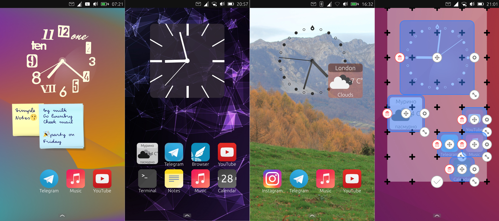

# Home

Home screen for Ubuntu Touch

Sometimes it is necessary to minimize the active application to the tray. So that the next time you turn on the screen, it would be active, but not occupy an active place. **uHome**, a home screen with widgets support, will help you with this task.

The application has its own built-in widgets. In addition, you can download other widgets to customize your home screen more.
- **An analog clock** will always show you the current time, and a variety of themes allow you to customize it to your liking.
- **Stickers** will help you remind you of the most important things. And their striking design attracts attention.
- **The link** can create an internet link or launch an application with URLdispatcher support.

## For developers
Widgets are able to receive information from the Internet, receive and send files from the Content Hub.

To write temporary files, the directory is used:
*/home/phablet/.cache/uhome.pavelprosto/*
Custom widgets are located at:
*/home/phablet/.local/share/uhome.pavelprosto/*

**Widgets can't!**
- Have access to user files
- Have access to a camera or microphone
- Have access to location
- Launch and access application files (only URLdispatcher available)
- Have access to sms, calendar and phone book

You can create your own widgets using **QML** and **PyOtherSide**. See examples of [standard widgets](https://github.com/pavelprosto94/uHome/tree/main/src) and example of [weather widget](https://github.com/pavelprosto94/openweatermapwidget).

**Each widget is a folder with its name, consisting of:**

**Main.qml** is the body of the widget (required)

**SettingsMain.qml** If your application needs additional settings, you can create this page

**thumbnail.jpg** A thumbnail of your widget in the widget browser

### Create link for your programm
If you would like to add your application to the home screen using the URLDispatcher

    onClicked: {
      Qt.openUrlExternally("uhome://createlink/?name=VideoPlayer&url=uvideo://&backgroundcolor=#00000000&icon=img/uVideo.svg")
    }

  **name** link name
  
  **url** if your program support URLDispatcher paste link there

  **backgroundcolor** color in ARGB(alpha, red, green, blue) format. If the icon does not have a transparent background, then this parameter will not be visible

  **icon** You can set icon for standard path ["img/{iconname}.svg"](https://github.com/pavelprosto94/uHome/tree/master/src/Link/img), or set the icon in BASE64 format

In creating a widget, you can use the standard functions of the application

### Settings widget
Each widget can contain an array with *"settings"*. It is important to remember that each setting is saved to a text document. Don't forget to transform parameters to String(*.toString()*) format if necessary.

You can apply these settings using the onSettingsChanged function

    onSettingsChanged:{
        if (settings.length>0) backgroundcolor=settings[0]
        if (settings.length>1) handcolor=settings[1]
        if (settings.length>2) arrowsource=settings[2]
        if (settings.length>3) glasssource=settings[3]
    }

[See example](https://github.com/pavelprosto94/uHome/blob/master/src/Analog%20Clock/Main.qml)

### Secondary functions
**Dialog**

If you need to display a message, use myDialog:

    myDialog.text=i18n.tr("Failed import file: "+namefile)
    myDialog.visible=true

If you need user confirmation action, use Connect to myDialog:

    property bool enblcon: false
    Connections {
            enabled: parent.enblcon
            target: myDialog
            onClicked: { 
            parent.enblcon=false
            *{your code there}*
            });
            }
        }
    
**ListFiles**    
You can get a list of files for your widget using the already created function:

    python_main.call('main.getListFiles', ["{path}","{extension}"], function (returnValue) {
        *{your code there}*
    }

**Fileexists**

    python_main.call('main.fileexists', ["{path}"], function(returnValue) {
        *{your code there}*
    }

**Import files**

If your widget needs to add files from the user, you can use the importPage component:

    Connections {
        enabled: parent.visible
        target: importPage
        onImported: { 
            *{your code there}*
        }
    }

Don't forget to move the added files to the app cache. After the phone restarts, ContentHub closes all connections.

    if (importPage.activeTransfer.items[0].move("/home/phablet/.cache/uhome.pavelprosto/")==false) {
        *{show error}*
    } else {
        importPage.activeTransfer.finalize()
        *{your code there}*
    }

[See example](https://github.com/pavelprosto94/uHome/blob/master/src/Link/SettingsMain.qml#L273)

**ColorPicker Dialog**

If your widget needs to change the color of a component, you can use the ColorPicker. It is an open source project, so you can use this component in any of your programs.

Copy the **ColorPicker.qml** (Color Picker Dialog) and **Checkerboard.qml** (Color Sketch) files to your directory.

Add component to code:

    ColorPicker{
        id: colorPicker
        property var obj_target
        visible: false
        onConfirm:{
          obj_target.color=colorValue
        }
    }

You can assign a source color using **.setColor** and extract the selected color using the **.color** property:

    onClicked:{
              colorPicker.setColor=color2.color
              colorPicker.obj_target=color2
              colorPicker.visible=true
            }

[See example](https://github.com/pavelprosto94/uHome/blob/master/src/Analog%20Clock/SettingsMain.qml#L140)

## Build
In the terminal, go to our directory with the project and enter the command:
    
    clickable
    
The project will compile and run on our phone
## License

Copyright (C) 2021  Pavel Prosto

This program is free software: you can redistribute it and/or modify it under the terms of the GNU General Public License version 3, as published
by the Free Software Foundation.

This program is distributed in the hope that it will be useful, but WITHOUT ANY WARRANTY; without even the implied warranties of MERCHANTABILITY, SATISFACTORY QUALITY, or FITNESS FOR A PARTICULAR PURPOSE.  See the GNU General Public License for more details.

You should have received a copy of the GNU General Public License along with this program.  If not, see <http://www.gnu.org/licenses/>.
